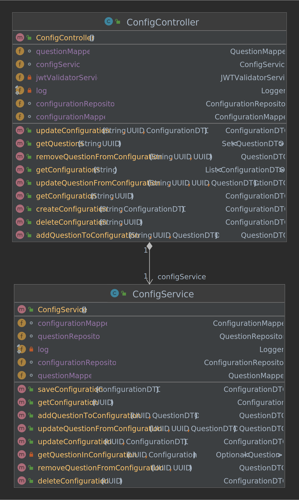

# Towercrush-Backend

This repo serves to persist the towercrush data in a db and to communicate with different microservices.

<!-- TOC -->

* [Getting started](#getting-started)
    * [Run](#run)
        * [Project build](#project-build)
        * [Build with docker](#build-with-docker)
        * [Run local with dependencies](#run-local-with-dependencies)
    * [Testing Database](#testing-database)
* [Rest mappings](#rest-mappings)
    * [Swagger-Ui (if started)](#swagger-ui--if-started-)
* [Class Diagrams](#class-diagrams)

<!-- TOC -->

# Development

## Getting started
> Beginning of additions (that work)

Make sure you have the following installed:

- Java: [JDK 1.17](https://www.oracle.com/java/technologies/javase/jdk17-archive-downloads.html) or higher
- Maven: [Maven 3.6.3](https://maven.apache.org/download.cgi)
- Docker: [Docker](https://www.docker.com/)
- PostgreSQL: [PostgreSQL](https://www.postgresql.org/download/)

### Run
### Project build
To build the project, run:
```sh
mvn install
```

in the project folder.
Then go to the target folder:
```sh
cd target
```
and run:
```sh
java -jar towercrush-backend-0.0.1-SNAPSHOT.jar
```
to start the application.


### Build with docker
To run your local changes as a docker container, with all necessary dependencies,
build the Docker container with:

```sh
docker compose up --build
```
You can remove the containers with:
```sh
docker compose down
```

### Run local with dependencies
To run your local build within your IDE, but also have the dependencies running in docker, follow the steps
to build the project, then run the dependencies in docker with the following:
```sh
docker compose -f docker-compose-dev.yaml up 
```
You can remove the containers with:
```sh
docker compose -f docker-compose-dev.yaml down
```

> End of additions


### Testing Database

to setup a database with docker for testing you can use

```sh
docker run -d -p 5432:5432 -e POSTGRES_USER=postgres -e POSTGRES_PASSWORD=postgres -e POSTGRES_DB=postgres  --rm --name towercrush-database postgres
```

To stop and remove it simply type

```sh
docker stop towercrush-database
```

## Rest mappings

Rest mappings are defined
in [`towercrush-service/src/main/java/com/towercrushservice/towercrushservice/controller/TowercrushController.java`](towercrush-service/src/main/java/com/towercrushservice/towercrushservice/controller/TowercrushController.java)

### Swagger-Ui (if started)

Access swagger-ui for visuals under: ```http://localhost/minigames/towercrush/api/v1/swagger-ui/index.html#/``` and
fill ```http://localhost/minigames/towercrush/api/v1/v3/api-docs``` into the input field in the navbar.


## Class Diagrams



